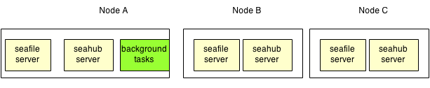

*Note:* Before you try to deploy file search office documents preview, make sure other parts of your seafile cluster are already working, e.g upload/download files in a web browser. Make sure memcached is configured as described in ["Deploy in a cluster"](./deploy_in_a_cluster.md).

# Enable search and background tasks in a cluster

**Note**: Since Seafile Server 5.0.0, all config files are moved to the central **conf** folder. [Read More](../deploy/new_directory_layout_5_0_0.md).

In the seafile cluster, only one server should run the background tasks, including:

- indexing files for search
- email notification
- office documents converts service

Let's assume you have three nodes in your cluster: A, B, and C.

* Node A is backend node that run background tasks.
* Node B and C are frontend nodes that serving requests from clients.




## Configuring Node A (the backend node)

If you following the steps on settings up a cluster, node B and node C should have already be configed as frontend node. You can copy the configuration of node B as a base for node A. Then do the following steps:

### Install Dependencies (Java, LibreOffice, poppler)

On Ubuntu/Debian:
```
sudo apt-get install openjdk-7-jre libreoffice poppler-utils python-uno # or python3-uno for ubuntu 14.04+
```

On CentOS/Red Hat:
```
sudo yum install java-1.7.0-openjdk
sudo yum install libreoffice libreoffice-headless libreoffice-pyuno
sudo yum install poppler-utils
```


Edit **seafevents.conf** and ensure this line does NOT exist:

```
external_es_server = true
```

Edit **seahub_settings.py** and add a line:

```
OFFICE_CONVERTOR_NODE = True
```

### Edit the firewall rules

In your firewall rules for node A, you should open the port 9500 (for search requests).

## Configure Other Nodes

On nodes B and C, you need to:

* Edit `seafevents.conf`, add the following lines:
```
[INDEX FILES]
external_es_server = true
es_host = <ip of node A>
es_port = 9500
```

Edit **seahub_settings.py** and add a line:

```
OFFICE_CONVERTOR_ROOT = http://<ip of node A>
```

Make sure requests to http://<ip of node A> is also handled by seahub. For example , you may need to add this nginx configuration in the background node:

```
server {
      listen 80;
      server_name <IP of node A>;
      location / {
          fastcgi_pass    127.0.0.1:8000;
          ...
  }
```

As a simple test, you can use this command to test if you set it up correctly.

```
curl -v http://<IP of node A>/office-convert/internal/status/
```

It should say "400 Bad Request" when you have nginx config updated.


## Start the background tasks

Before starting background tasks, you have to start seafile and seahub on the backend node, too.

```
./seafile.sh start
./seahub.sh start-fastcgi
```

On node A (the background tasks node), you can start/stop background tasks by:

```
./seafile-background-tasks.sh { start | stop | restart }
```
